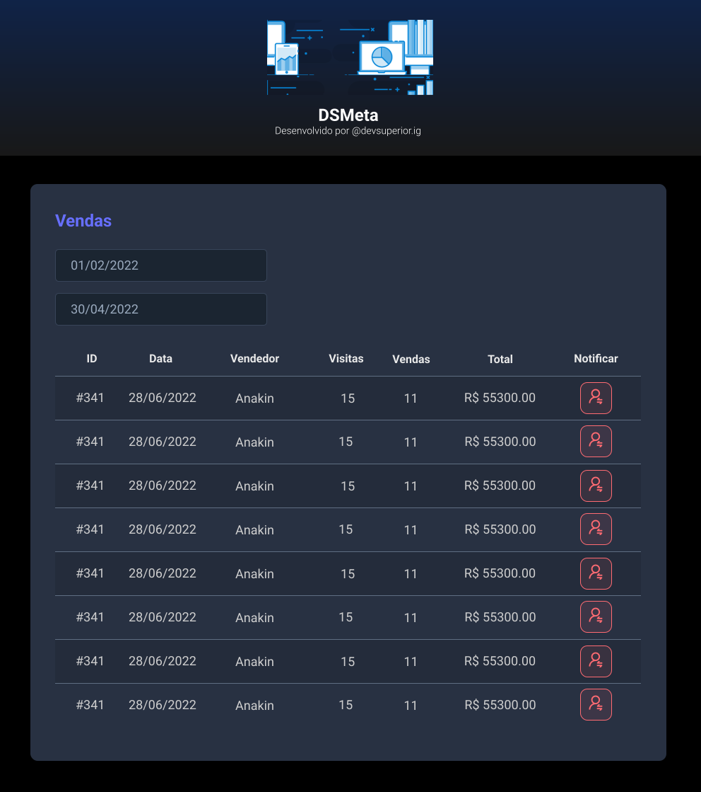

<h1 align="center">
DSMeta📈
</h1>

## 📝 Descrição

Projeto FullStack produzido juntamente a um evento da DevSuperior com a finalidade de desenvolver um aplicativo de registro de vendas, oferecendo funcionalidades como a busca de vendas através de um dado intervalo de tempo estabelecido no calendário, e também notificar via SMS dados relacionados a venda de um determinado vendedor. 

 

### 🚀 Tópicos abordados:

- API REST com Java e Spring Boot
- Banco de Dados Relacional
- Front-end com ReactJS
- Camadas, componentes e boas práticas 
- Integração com SMS utilizando o Twilio

 

## 💻 Layout Web

 

